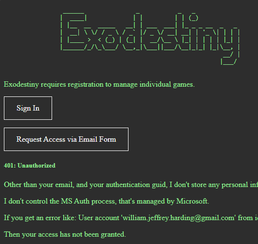
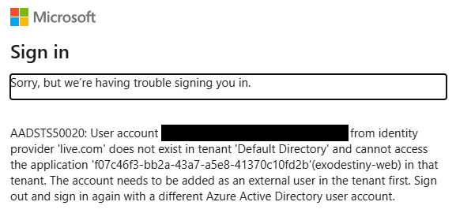
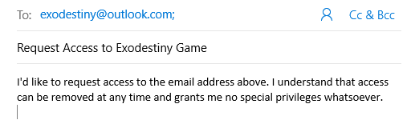
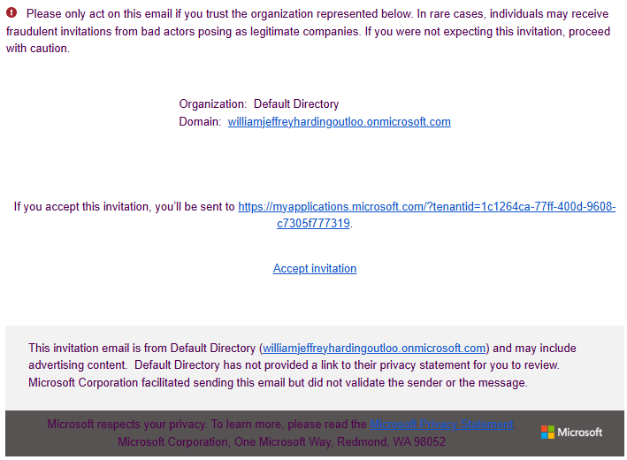
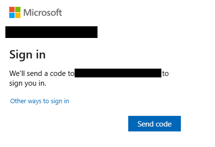
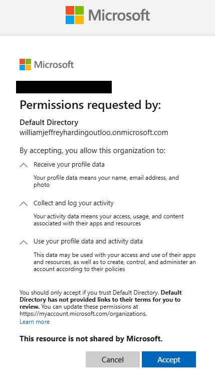

# How to create a new account.

Account management is all through [Azure Entra ID](https://www.microsoft.com/en-us/security/business/identity-access/microsoft-entra-id). I don't manage any of it. 

This is the best way to manage authentication without having me store passwords (which I don't want). It is the most secure for you and for me. It uses MS Live Login to authenticate, taking the whole process out of my hands. 

## Steps to log in

### when you go to start a new game or continue a game, it will check your credentials. If you don't have them, it will send you to the sign-in page. 

### When you try to log in, it will trigger the MSAuth page. 

If you get this error, it is because I have not yet added you to the Active Directory Group that will grant you access. You will need to request accesss. 

### Use the request access link to create the email form and submit it. 

### Submit that form and I will add you to the group. Once approved you should be able to log in. 

This is the only part of the process that I'm involved in. I'll take that email address and add it to my directory. This will allow you to log into the game.

I'll have a legit form at some point. But for right now I'm keeping the infrastructure light. This enables users to play the game and create accounts. 

### Accept the invitation from 
You'll get an invite email from `invites@microsoft.com`. I don't manage that account and I won't see what you enter. 

### Log into MS Live
I won't see this process, or have anything to do with it. MS Live will send a code to your email. 

Note that in the example above MS will send a code to your email. That depends on how you have authentication set up with your email. I don't control that process. 

### Accept the terms

My app (Exodestiny the game) will have access to your email address. When you log into the site I'll be able to link your email address (via the oid guid) to your session data. I need this to save your game. I don't enter any other information into that form. Outside of my Active Directory tenant I won't have access to any of your data. 
